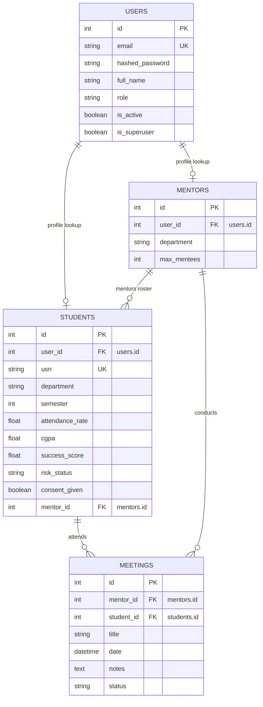

# agreed Database Schema — MentorOS

This document defines the relational database schema representing our core data entities, constraints, and relational mappings.

---

## Entity-Relationship Summary

---

## 1. Table: `users`
Represents authentication credentials and department roles.

| Column | Type | Constraints | Default | Description |
| :--- | :--- | :--- | :--- | :--- |
| `id` | INTEGER | PRIMARY KEY, AUTOINCREMENT | | Unique internal identifier |
| `email` | VARCHAR(255) | UNIQUE, NOT NULL, INDEX | | Login email address |
| `hashed_password` | VARCHAR(255) | NOT NULL | | Hashed representation |
| `full_name` | VARCHAR(255) | NOT NULL | | User's full name |
| `role` | VARCHAR(50) | NOT NULL | 'Student' | Options: 'Student', 'Mentor', 'HOD', 'Admin' |
| `is_active` | BOOLEAN | | TRUE | Access suspension flag |
| `is_superuser` | BOOLEAN | | FALSE | System administrator privilege |

---

## 2. Table: `students`
Student profile, tracking analytics signals and privacy preferences.

| Column | Type | Constraints | Default | Description |
| :--- | :--- | :--- | :--- | :--- |
| `id` | INTEGER | PRIMARY KEY, AUTOINCREMENT | | Unique internal identifier |
| `user_id` | INTEGER | FOREIGN KEY (`users.id`), UNIQUE, NOT NULL | | References the user account |
| `usn` | VARCHAR(50) | UNIQUE, NOT NULL, INDEX | | University Seat Number |
| `department` | VARCHAR(100) | NOT NULL | | Academic branch (e.g., CSE, ISE) |
| `semester` | INTEGER | NOT NULL | | Current semester (1 to 8) |
| `attendance_rate` | FLOAT | | 100.0 | Cohort class attendance rate (%) |
| `cgpa` | FLOAT | | 0.0 | Cumulative Grade Point Average |
| `success_score` | FLOAT | | 100.0 | Computed success score (0 to 100) |
| `risk_status` | VARCHAR(50) | | 'Green' | Bands: 'Green', 'Amber', 'Coral' |
| `consent_given` | BOOLEAN | | TRUE | Data privacy consent flag |
| `mentor_id` | INTEGER | FOREIGN KEY (`mentors.id`), NULLABLE | | Assigned mentor reference |

---

## 3. Table: `mentors`
Mentor profiles and roster constraints.

| Column | Type | Constraints | Default | Description |
| :--- | :--- | :--- | :--- | :--- |
| `id` | INTEGER | PRIMARY KEY, AUTOINCREMENT | | Unique internal identifier |
| `user_id` | INTEGER | FOREIGN KEY (`users.id`), UNIQUE, NOT NULL | | References the user account |
| `department` | VARCHAR(100) | NOT NULL | | Academic branch matching |
| `max_mentees` | INTEGER | | 20 | Roster capacity allocation limit |

---

## 4. Table: `meetings`
Tracks scheduling, check-ins, and logged session summaries.

| Column | Type | Constraints | Default | Description |
| :--- | :--- | :--- | :--- | :--- |
| `id` | INTEGER | PRIMARY KEY, AUTOINCREMENT | | Unique internal identifier |
| `mentor_id` | INTEGER | FOREIGN KEY (`mentors.id`), NOT NULL | | Mentoring host |
| `student_id` | INTEGER | FOREIGN KEY (`students.id`), NOT NULL | | Mentored student |
| `title` | VARCHAR(255) | NOT NULL | | Meeting header |
| `date` | TIMESTAMP | NOT NULL | | Date and time scheduled |
| `notes` | TEXT | NULLABLE | | Logs and action items |
| `status` | VARCHAR(50) | | 'Scheduled' | 'Scheduled', 'Completed', 'Cancelled' |
